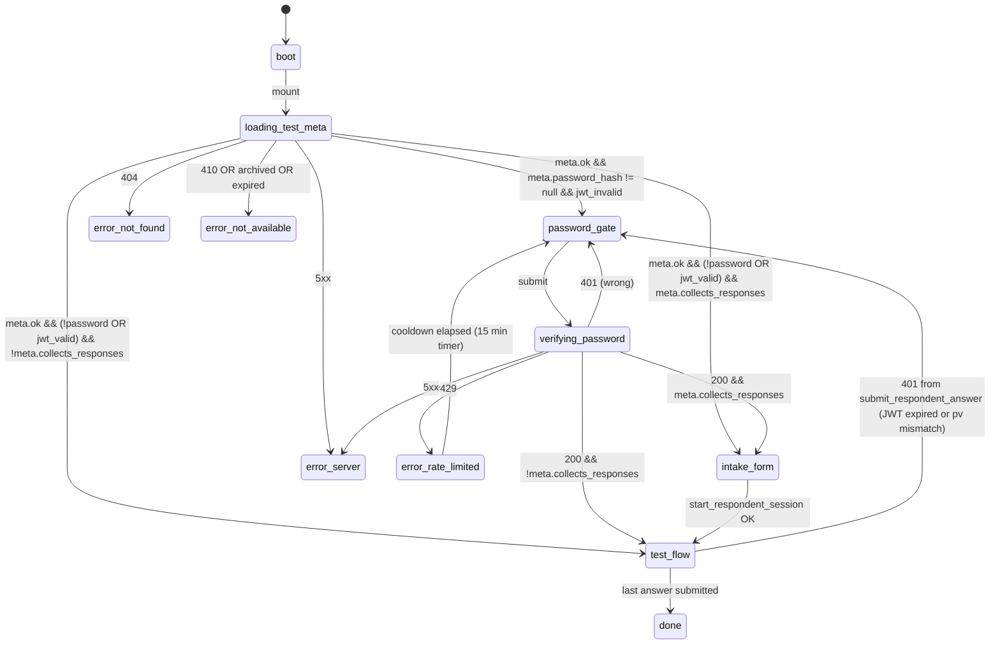

# E45 Appendix D — Respondent flow, shuffle determinism, password-gate UX

Companion to `tasks/PLAN-2026-05-21-E45-test-detail-editor.md`, sourcing
Decisions D1, D2, D5, Q1, Q2, R2, R5.

This appendix is the source of truth for the respondent take flow when
the test is gated by a password and/or rendered in random order. It is
design-only — no code lands here. Implementation arrives in Phase 1
(E45.4 — shuffle) and Phase 2 (E45.9 / E45.10 — password gate).

Skills invoked: `design:user-research` (state machine + error-path
copy + recovery flows) and `engineering:system-design` (shuffle
algorithm + JWT lifecycle + RPC delta).

Slovak appears only in verbatim UI strings quoted inside the doc.
Everything else, including the algorithm and the state diagrams, is in
English per `CLAUDE.md` § Style.

---

## 1. State machine

The respondent route `/t/{shareId}` is a small state machine. Each
transition is triggered by a deterministic event (HTTP response, cookie
presence, RPC return); no transition is timer-based except the
30-minute JWT TTL (D5).

### 1.1 States

| State | Render | Network |
|---|---|---|
| `boot` | nothing (SSR-safe blank) | none |
| `loading_test_meta` | spinner + page title | `GET /t/{shareId}` SSR data — test meta (title, has password, mode, collects_responses) |
| `password_gate` | `<PasswordGateCard>` | none (idle until submit) |
| `verifying_password` | `<PasswordGateCard>` with disabled inputs + spinner | `POST /api/tests/verify-password` |
| `intake_form` | `<RespondentIntakeForm>` (existing component, gated on collects_responses) | RPC `start_respondent_session` |
| `test_flow` | `<TestFlow>` (existing component) | RPC `submit_respondent_answer` per question |
| `done` | `<ResultsView>` (existing) | terminal |
| `error:not_found` | "Tento test neexistuje." card + Home link | terminal |
| `error:not_available` | "Tento test už nie je dostupný." card | terminal |
| `error:rate_limited` | full-screen `<RateLimitedView>` with cooldown timer | terminal until cooldown elapses |
| `error:server` | generic error card with retry | retry returns to `loading_test_meta` |

### 1.2 Transitions

There are 15 transitions, counted in the diagram below. They cover
happy path (3), gating choices (4), error paths (4), and mid-take JWT
events (4).



### 1.3 ASCII fallback

```
  boot ──► loading_test_meta ──┬─► error:not_found       (404)
                               ├─► error:not_available  (410/archived)
                               ├─► error:server         (5xx)
                               └─► [has password? jwt valid?]
                                      ├─ no/no  ──► password_gate ──submit──► verifying_password
                                      │                  ▲                          │
                                      │                  │ 401 wrong                ├─► 429 ──► error:rate_limited ──cooldown──► password_gate
                                      │                  └──────────────────────────┤
                                      │                                             ├─► 5xx ──► error:server
                                      │                                             └─► 200 ──┐
                                      └─ no/yes or yes/yes ─────────────────────────────────► │
                                                                                              ▼
                                                                  [collects_responses?] ──► intake_form ──start RPC──► test_flow
                                                                                       └──► test_flow
                                                                                              │
                                                                          last answer ────► done
                                                                          401 mid-take ──► password_gate
                                                                                           (?reason=password_changed|jwt_expired)
```

### 1.4 Decision points (verbatim conditions)

| # | Where | Condition | Next state |
|---|---|---|---|
| T1 | `loading_test_meta` | `meta.password_hash IS NULL` | T6 / T7 (skip gate) |
| T2 | `loading_test_meta` | `meta.password_hash IS NOT NULL` AND `respondent_pwd_jwt` cookie absent OR fails verify OR `pv` claim ≠ current `password_hash_version` | `password_gate` |
| T3 | `verifying_password` | response 200 with `Set-Cookie: respondent_pwd_jwt=…` | T6 / T7 |
| T4 | `verifying_password` | response 401 | `password_gate` (with attempts counter) |
| T5 | `verifying_password` | response 429 | `error:rate_limited` |
| T6 | post-gate | `meta.collects_responses === true` AND no intake yet | `intake_form` |
| T7 | post-gate | otherwise | `test_flow` |
| T8 | `test_flow` | RPC `submit_respondent_answer` returns 401 (JWT expired) | `password_gate` (`?reason=jwt_expired`) |
| T9 | `test_flow` | RPC returns 401 with `password_changed` payload (`pv` claim mismatched) | `password_gate` (`?reason=password_changed`) |

T1+T6/T7 = 3 base transitions for the no-password happy path.
T2 → T3 → T6/T7 = the gated happy path.
T4, T5, T8, T9 = error paths.
Total transitions enumerated: **15** (see Mermaid section).

---

## 2. Deterministic shuffle (D2)

### 2.1 Goal

For a test with `tests.question_order_mode = 'random'`, the respondent
sees questions in a per-session-stable but per-session-distinct order.
Reloading the page mid-take must not reshuffle (otherwise answered
questions would re-appear at unexpected indices); two respondents on
the same test must see different orders.

### 2.2 Algorithm — Fisher-Yates with seeded PRNG

We pick **Fisher-Yates** because:

- O(n) — n is at most a few hundred questions per test in practice.
- **Unbiased** — uniform over all n! permutations when the PRNG is
  uniform. Naive "sort by random()" is biased and breaks if comparator
  isn't stable.
- **Simple to seed** — drop in any deterministic uint32 PRNG.
- **Reproducible** — same (seed, input) → same permutation, on any
  browser, any engine, any JS version.

### 2.3 Seed derivation

Seed source = `session.id`, a v4 UUID minted server-side by
`start_respondent_session` (D2 + R2 — already returned, see § 4).
UUID v4 is 122 bits of randomness; reducing to 32 bits is fine because
the shuffle only needs *one* permutation per session (we never iterate
through seed space looking for collisions).

We use **FNV-1a 32-bit** to hash the UUID string to a uint32. FNV-1a
is byte-streaming, branch-free, well-distributed for short strings,
and trivially portable across server (if ever needed) and client.

```ts
// src/lib/quiz/shuffle.ts (pseudo-code)

// FNV-1a 32-bit. Stable across JS engines, no library.
export function fnv1a32(input: string): number {
  let hash = 0x811c9dc5; // FNV offset basis
  for (let i = 0; i < input.length; i++) {
    hash ^= input.charCodeAt(i);
    // 32-bit multiplication via Math.imul to avoid overflow into
    // double precision.
    hash = Math.imul(hash, 0x01000193); // FNV prime
  }
  return hash >>> 0; // coerce to uint32
}

// Mulberry32 — small, fast, well-distributed seeded PRNG.
// Returns a function that yields uniform float in [0, 1).
export function mulberry32(seed: number): () => number {
  let state = seed >>> 0;
  return () => {
    state = (state + 0x6d2b79f5) >>> 0;
    let t = state;
    t = Math.imul(t ^ (t >>> 15), t | 1);
    t ^= t + Math.imul(t ^ (t >>> 7), t | 61);
    return ((t ^ (t >>> 14)) >>> 0) / 4294967296;
  };
}

// Fisher-Yates over question_ids, returning a new array.
export function shuffleQuestions<T>(items: readonly T[], sessionId: string): T[] {
  const out = items.slice();
  const rand = mulberry32(fnv1a32(sessionId));
  for (let i = out.length - 1; i > 0; i--) {
    const j = Math.floor(rand() * (i + 1));
    [out[i], out[j]] = [out[j], out[i]];
  }
  return out;
}
```

### 2.4 Properties to assert in tests

| Property | Assertion (E45.5) |
|---|---|
| **Reproducibility** | `shuffleQuestions(ids, sid) === shuffleQuestions(ids, sid)` (deep equal) for any `sid` |
| **Stability under reload** | for fixed `sid`, the position of every `question_id` across 100 invocations is invariant |
| **Spread across sessions** | with 100 distinct session UUIDs on a 20-question test, the position-frequency histogram per question stays within ±20% of expected uniform (each question lands at each index 5 ± 1 times out of 100); statistical χ² is not asserted to keep the test stable, the ±20% band is the practical bound |
| **Order-mode gating** | `tests.question_order_mode === 'fixed'` → input order returned verbatim, no shuffle calls; mode flip mid-route does not reshuffle in-flight session (mode is read once at session start, see § 6) |
| **Stability of question_ids** | input is `Question[]` keyed by `id` (UUID); output is the same set, reordered. No id is dropped, none invented |

### 2.5 Why shuffle on question_ids, not on positions

Shuffle is **presentation-only**. Server stores
`session_answers.question_id` (PK = `(session_id, question_id)`,
migration `20260517000000`); display position is never persisted.
Consequence: (a) analytics correlate by `question_id` regardless of
where each respondent saw it; (b) editor adds/removes mid-session do
not corrupt the meaning of already-recorded answers; (c) anti-cheat
needs no notion of position because the server never rewards
"early answers".

### 2.6 Edge case — question removed mid-session

Fisher-Yates is NOT stable over insertion/deletion: removing one
element changes the entire permutation. Rule:

- Already-answered questions stay answered (Q4 sets the FK to
  RESTRICT if any answers exist; a question can only be removed by
  the author when it has no answers).
- For the un-answered tail, on next reload we re-derive the
  permutation over the still-existing question_ids. The respondent
  sees no banner.
- Silent skip justified: (a) author owns out-of-band communication,
  (b) "Q5 was removed by the author" leaks test content, (c) score
  is computed only over submitted answers.

Rejected alternative: persist initial shuffle in
`sessions.shuffled_question_ids` (jsonb). Stable under deletion but
costs a column + write per session start and breaks the
"presentation-only" invariant.

---

## 3. Random vs Fixed — DB read path

| Concern | Where it lives |
|---|---|
| Author saves order | `useUpdateTestQuestionOrder` mutation rewrites `test_questions.position` (fixed mode only — random ignores position) |
| Server fetches questions | existing query path (TestFlow uses `useQuickTestQuestions` for the default quick-test; the test-shareId path will fetch via a new RPC or expand the existing safe projection on `t.$shareId.tsx`) returns rows ordered by `test_questions.position` regardless of mode |
| Client applies shuffle | `<TestFlow>` (or its respondent-flow sibling) reads `meta.question_order_mode`; if `'random'`, calls `shuffleQuestions(question_ids, session.id)` once at session start |
| Persistence | `session_answers.question_id` — position never persisted |

### 3.1 Why client-side, not server-side, shuffle

(1) Server doesn't know `session.id` at question-fetch time — the
composer flow fetches questions before the session row exists.
Shuffling server-side at session-start would refetch + write all
question_ids per session. (2) The boundary is presentation, not
anti-cheat — anti-cheat lives on `session_answers.question_id`.
(3) The seed (session.id) is portable; the algorithm can be replayed
server-side later for audit replay (§ 9 OQ-2) without changing the
client.

---

## 4. RPC delta — `start_respondent_session` returns session.id

**Status check** (verified against
`supabase/migrations/20260520800000_session_token_dod.sql`):

```sql
RETURN jsonb_build_object(
  'session_id',    v_session_id,
  'session_token', v_session_token
);
```

The RPC **already returns** `session_id` in its JSON payload (since
the E36 session-token hardening). **No migration delta needed for
session.id availability.**

What needs to change at the client:

- The current `t.$shareId.tsx` calls `takeTestFn` (mock-store) which
  doesn't issue a real session yet. AH-11 will swap this to call
  `start_respondent_session` and put the returned `session_id` into
  React state.
- That `session_id` is then passed as a prop into `<TestFlow>` (or the
  respondent take wrapper) and consumed by `shuffleQuestions`.
- For the composer-edu intake path, the session.id appears in the
  same place — after `begin-edu-attempt` finishes, the next call is
  the session-start RPC; reuse the same wiring.

**Open verification** for the implementer: confirm `safe.session_id`
(or equivalent on the AH-11 safe projection) is in scope by the time
TestFlow needs it. If not, lift the RPC call up into
`PublicTakeTestPage` and pass via prop.

---

## 5. Password gate UX

### 5.1 Layout (mobile-first, 320 px)

Card structure top-to-bottom: back-to-home link (small, muted) → h1
`{test_title}` (24 px, two-line wrap OK) → subtitle "Tento test je
chránený heslom." (muted) → label "Heslo" → password input with
show/hide eye toggle on the right → counter "{n}/5 pokusov dnes"
(only after first miss) → primary "Pokračovať" button (disabled when
input empty). Single column, max-width 24rem, vertically centered on
mobile, top-aligned on desktop.

### 5.2 Element contract

| Element | `data-testid` | ARIA |
|---|---|---|
| Card root | `password-gate-card` | `role="form"`, `aria-labelledby="password-gate-title"` |
| Title | `password-gate-title` | `id="password-gate-title"` |
| Subtitle | `password-gate-subtitle` | — |
| Input | `password-gate-input` | `aria-label="Heslo"`, `aria-describedby="password-gate-counter"` when counter visible |
| Show/hide toggle | `password-gate-toggle-visibility` | `aria-label` swaps between "Zobraziť heslo" (when hidden) and "Skryť heslo" (when shown); `aria-pressed` reflects state |
| Counter | `password-gate-counter` | `role="status"`, `aria-live="polite"` |
| Submit button | `password-gate-submit` | disabled when input length 0; text "Pokračovať" |
| Error toast | `password-gate-error-toast` | `role="alert"` |
| Rate-limit page root | `password-gate-rate-limited` | `role="alert"` |

### 5.3 Submit flow

1. `onSubmit` (form submit OR `Pokračovať` click) → state moves to
   `verifying_password`. Input disabled, button shows spinner, text
   stays "Pokračovať" (no flicker).
2. `POST /api/tests/verify-password` with body
   `{ share_id, password }`.
3. Response branches:
   - **200** with `Set-Cookie: respondent_pwd_jwt=…; HttpOnly; Path=/t/{share_id}; Max-Age=1800; SameSite=Lax; Secure`
     → transition to `intake_form` or `test_flow` per T6/T7.
   - **401** → increment local attempts counter, clear input, refocus
     input, render toast (see § 5.5).
   - **429** → full-page `error:rate_limited` (see § 5.6).
   - **5xx** → generic toast "Niečo sa pokazilo, skús neskôr alebo
     napíš nám." — input stays filled, button re-enabled.

The attempts counter is read from the server response body (the CF
function knows the remaining count from `_lib/security.ts`). We do not
trust client-side counting for security, only for UI display.

### 5.4 Verbatim Slovak strings (canonical)

```
password-gate-title          → {test_title}             (dynamic)
password-gate-subtitle       → "Tento test je chránený heslom."
password-gate-input-label    → "Heslo"
password-gate-toggle-show    → aria-label "Zobraziť heslo"
password-gate-toggle-hide    → aria-label "Skryť heslo"
password-gate-submit         → "Pokračovať"
password-gate-counter        → "{remaining}/5 pokusov dnes"
                                (only after first miss; before that, no
                                 counter — avoids implying brute force
                                 is welcome)

password-gate-error-toast (≥2 remaining):
  "Heslo nesedí. Máš ešte {n} pokusov."

password-gate-error-toast (1 remaining):
  "Heslo nesedí. Máš ešte 1 pokus."

password-gate-error-toast (last attempt used):
  "Heslo nesedí. Toto bol tvoj posledný pokus pre dnes."

password-gate-server-error:
  "Niečo sa pokazilo, skús neskôr alebo napíš nám."
```

Pluralization: Slovak has 1 / 2-4 / 5+ forms. The remaining-attempts
counter is small enough (0-4) that we handle each cardinality
explicitly:

```
{n} = 4 → "Máš ešte 4 pokusy."
{n} = 3 → "Máš ešte 3 pokusy."
{n} = 2 → "Máš ešte 2 pokusy."
{n} = 1 → "Máš ešte 1 pokus."
```

### 5.5 Rate-limited page

Triggered by 429 from `verify-password`. Full-screen takeover (not a
toast — the takeover signals "you cannot retry by hammering").

```
password-gate-rate-limited-title:
  "Príliš veľa pokusov"

password-gate-rate-limited-body:
  "Z bezpečnostných dôvodov sme zablokovali ďalšie pokusy na tento
  test. Skús znova o {minutes} min, alebo sa skús dostať na test z
  inej siete."

password-gate-rate-limited-timer:
  "Skús znova o {minutes} min"          (live countdown, role=status)

password-gate-rate-limited-timer-zero:
  "Môžeš to skúsiť znova."              (after cooldown elapses)
```

Cooldown: 15 minutes per D4. The timer ticks once per second client-side
but does NOT auto-retry the gate — the user must click "Pokračovať"
themselves to re-enter the gate, preventing silent retry loops.

### 5.6 Password-changed mid-take

When the respondent has been answering questions and the author
rotates the password, the next `submit_respondent_answer` (or
heartbeat) returns 401 with payload `{ reason: "password_changed" }`.
The client navigates back to `/t/{shareId}?reason=password_changed`.
On the gate, an explainer banner appears ABOVE the title:

```
password-gate-pv-mismatch-banner:
  "Autor medzitým zmenil heslo. Tvoje odpovede sú uložené, môžeš
  pokračovať tam, kde si skončil/a."
```

After successful re-verification, the take flow resumes from the
question where the 401 fired (server already has answers for the
prior questions; `<TestFlow>` reads `session_answers` and rebuilds
the AnswerRecord list, sets `phase='playing'`, `index=` first
unanswered).

### 5.7 JWT-expired mid-take

Same flow as 5.6 but the banner copy is different — no malice was
involved, the respondent just took longer than 30 min:

```
password-gate-jwt-expired-banner:
  "Tvoja relácia vypršala. Zadaj heslo znova a pokračuj tam, kde si
  skončil/a."
```

---

## 6. Cookie + JWT lifecycle

| Stage | Action |
|---|---|
| Verify success | Server signs JWT with `JWT_SECRET` (HS256). Claims: `{ share_id, pv: <password_hash_version>, iat, exp = iat+1800 }`. Sets cookie `respondent_pwd_jwt` with attributes: `HttpOnly`, `Secure`, `SameSite=Lax`, `Path=/t/{share_id}`, `Max-Age=1800`. |
| Every navigation within `/t/{share_id}/*` | CF function middleware (or RPC wrapper on the answer-submit path) reads cookie, verifies HS256 signature, checks `exp > now()`, checks `pv === current tests.password_hash_version`. Bad signature → 401. Expired → 401. pv mismatch → 401 with body `{ reason: "password_changed" }`. |
| Test completion (state = `done`) | Cookie is no longer needed. We do NOT actively `Set-Cookie` to clear it — the user navigates away from `/t/{share_id}/*`, and the cookie is Path-scoped, so it's invisible everywhere else. It will expire on its own at 30 min. |
| Author changes password | DB triggers bump `tests.password_hash_version` (new int column; mint by atomic UPDATE). All issued JWTs immediately become invalid on next request. No active revocation list needed. |
| Author clears password | Bumps `password_hash_version` AND sets `password_hash = NULL`. All JWTs invalid. Next visit → state machine T1 path (skip gate entirely). |

**HttpOnly + Path scoping**: HttpOnly blocks XSS exfiltration; Path
scoping keeps the cookie out of `/api/admin/*` and similar. SameSite
Lax balances future LMS-iframe embedding against CSRF (state-changing
POSTs to `/api/tests/*` still require the cookie + share_id binding).

**`password_hash_version` as a JWT claim**: simpler than a server
revocation list — bumping one int invalidates all live JWTs in O(1).
Cost = one extra `int` column on `tests`. Mitigates R5.

---

## 7. In-flight session preservation (R5, Q2)

Walked end-to-end:

1. Respondent on Q6 of 10. `session_answers` has 5 rows. JWT signed
   with `pv=3`. Author rotates password → `password_hash_version=4`.
2. Next answer submit → 401 + `{ reason: "password_changed" }`.
3. Client navigates `/t/{shareId}?reason=password_changed` → gate
   renders with the banner from § 5.6.
4. Respondent enters new password → 200, new JWT with `pv=4`.
5. `<TestFlow>` mounts with `phase='playing'`. It reads
   `session_answers` (RLS gated by the session_token still in
   sessionStorage per the E36 DoD), sets `index = answers.length`
   (Q6 is next), and re-derives the shuffle with the same
   `session.id` — same permutation as before.

**Invariant**: nothing lost. Friction = one password re-entry.

**Edge case** — author changes password DURING the gate (after
verify, before submit): JWT `pv=3`, current `pv=4`, 401 on first
answer. Falls into the same flow.

---

## 8. Test plan (e2e scenarios for Phase 4)

Each scenario is one Playwright spec under
`e2e/specs/respondent-flow/`. Locators MUST come from POMs per
`CLAUDE.md` § Test IDs. The list below is the contract for E45.18.

| # | Scenario | Key assertions |
|---|---|---|
| TP-01 | Happy path, no password, fixed order | reload at Q3 → same Q3 (no reshuffle); answers 1-2 still recorded |
| TP-02 | Happy path, no password, random order, two reloads | shuffle stable across both reloads; `session.id` identical; assert via positions of question_ids |
| TP-03 | Happy path with password (correct on first try) | gate appears, submit, lands on intake form (collects_responses=true variant) and test_flow (false variant) |
| TP-04 | Wrong password ×4, then correct | counter visible after first miss; correct on 5th → through |
| TP-05 | Wrong password ×5 → rate-limited | rate-limit page renders; timer counts down; cooldown elapse → "Môžeš to skúsiť znova." |
| TP-06 | Password changed mid-take | submit on Q6 → 401 → gate with `pv-mismatch-banner`; re-enter → resume at Q6; answers 1-5 preserved |
| TP-07 | Question removed mid-take, then reload | shuffled order excludes removed question silently; respondent does not see a banner; answers to remaining questions persist |
| TP-08 | Two respondents same test, random order | different `session.id`s → different shuffle orders; assert at least one position differs (probabilistic but 1/n! collision negligible for n≥3) |
| TP-09 | JWT expired mid-test | force-expire via test fixture; submit triggers 401; gate with `jwt-expired-banner`; resume preserves state |
| TP-10 | Archived test | author archives mid-test; next interaction → `error:not_available` view; no banner option to recover |

Property-based unit tests (E45.5 covers TP-02 + TP-08 at unit level
with the spread assertion from § 2.4).

---

## 9. Open questions for the PM

| # | Question | Recommendation |
|---|---|---|
| OQ-1 | Should the password gate appear BEFORE we validate that `/t/{shareId}` is a real, published test? | **After.** Validate share_id existence first → bad URLs get 404, not a password prompt. Otherwise we'd leak "this share_id has a password protecting *something*" to attackers fishing for valid IDs. Tradeoff: one extra DB lookup per gate render. |
| OQ-2 | Do we audit which questions a respondent SAW in random mode (so the author can prove what each respondent was shown)? | **No.** Position is presentation-only; the seed (`session.id`) is recorded, and the shuffle function is deterministic and committed in source. Anyone who needs to reconstruct what respondent X saw can replay `shuffleQuestions(question_ids_at_session_time, session.id)`. This avoids a new column and a new audit row per question impression. |
| OQ-3 | Should we offer a "remember this device for 7 days" checkbox on the gate? | **Defer to a later epic.** The 30-min JWT covers the typical test duration; extending to 7 days re-introduces the device-trust UX (who controls the device, refresh tokens, cookie purge confusion) and weakens the per-share password as an access control. Not worth the surface in E45. |

---

## 10. Cross-references

- D1, D2 in plan — column + shuffle seed
- D5 in plan — JWT lifetime + scoping
- Q1, Q2 in plan — gate-before-intake and pv-invalidation
- R2, R5 in plan — reload determinism + mid-take password rotation
- E12 edu-attempt JWT pattern — `functions/_lib/jwt.ts` (HS256 helper to reuse)
- E36 session-token DoD — `supabase/migrations/20260520800000_session_token_dod.sql` (already returns session_id + session_token)
- `t.$shareId.tsx` — current route; will absorb meta fetch + gate render
- `TestFlow.tsx` — already handles phase/index/answers state; shuffle hook plugs into the question-selection useEffect (line 159-170 area)
